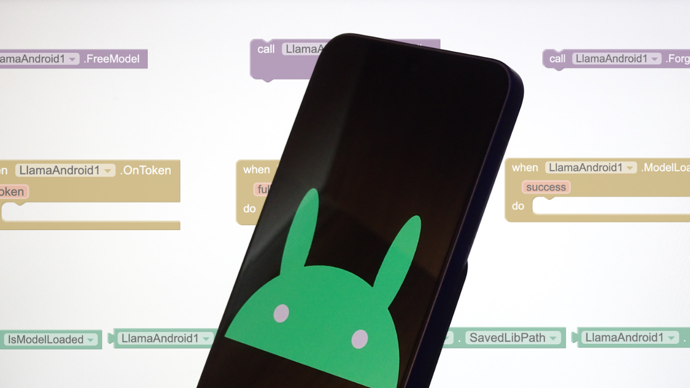
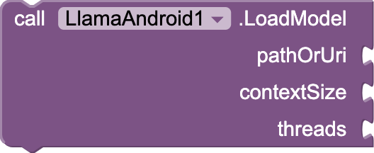
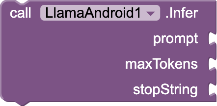
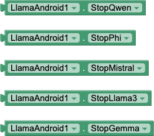
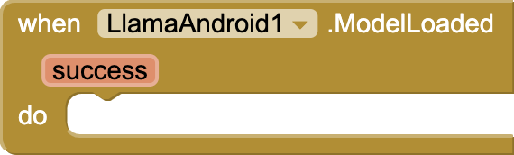
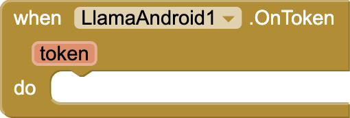
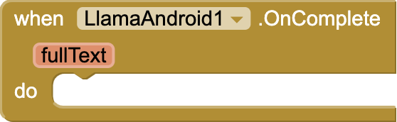
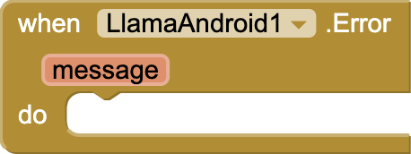

# LlamaAndroid

<p  align="center">

</p>
 
An MIT App Inventor extension for running GGUF language models fully on-device using [llama.cpp](https://github.com/ggerganov/llama.cpp).

---

## Overview

LlamaAndroid lets you load and run local LLMs inside any App Inventor app. It streams tokens as they generate, caches the model across restarts so users only pick the file once, and supports all the popular model families out of the box.
  
- Streaming token output
- Automatic model caching across app restarts
- Accepts direct file paths or content:// URIs from the file picker
- Zero-copy loading when models are placed in Downloads/models/
- Built-in stop string properties for Qwen, Llama 3, Mistral, Gemma and Phi
---

## Requirements

- MIT App Inventor or a compatible builder (Kodular, Niotron, etc.)
- [libllamajni.so](https://github.com/pocketive/libllamajni) (the native llama.cpp JNI bridge for Android)
- A GGUF model file, available on [HuggingFace](https://huggingface.co/models?search=gguf) etc.
- Java JDK 11+ and Apache Ant 1.10+ (only if building from source)
  
----

## Building from Source

Clone with submodules so the build dependencies come along:

```bash
git clone  --recurse-submodules https://github.com/pocketive/llamandroid.git
cd llamandroid
bash setup.sh
```

Build:

```bash
ant
```

The compiled extension will appear at `out/com.pocketive.llamandroid.aix`. Import it into App Inventor and you're ready.

---

## Usage

### Basic flow

1. Call `LoadLib` with the path to `libllamajni.so`
2. Wait for `LibsReady`
3. Check `SavedModelPath` — if empty, show a file picker; otherwise the model is already auto-loading
4. Call `LoadModel(path, contextSize, threads)`
5. Wait for `ModelLoaded(success)`
6. Call `Infer(prompt, maxTokens, stopString)`
7. Handle `OnToken` for streaming and `OnComplete` for the full result

### Stop strings

Pass the stop string as the third argument to `Infer`, or use the built-in properties:

| Model family | Property | Value |
|---|---|---|
| Qwen | `StopQwen` | `<\|im_end\|>` |
| Llama 3 | `StopLlama3` | `<\|eot_id\|>` |
| Mistral | `StopMistral` | `</s>` |
| Gemma | `StopGemma` | `<end_of_turn>` |
| Phi | `StopPhi` | `<\|end\|>` |

Pass an empty string to disable and run until `maxTokens` or the model's own end token.

### Tips

- Place GGUF files in `Downloads/models/` for zero-copy loading. The `ModelsFolder` property gives you the exact path.
- Models loaded via file picker are copied to internal storage on first use and automatically load on every launch after that.
- Call `FreeModel` when you're done to release RAM

---

## Blocks

### Functions

#### LoadLib
> Load `libllamajni.so` from a file path or content:// URI.


  
---
#### LoadModel
> Load a GGUF model. Fires `ModelLoaded(success)` when done.



---
#### Infer
> Run inference on the loaded model. Streams via `OnToken`, finishes with `OnComplete`.



---
#### FreeModel
> Free the loaded model from memory.


---
#### ForgetLib
> Clear the saved lib path so `LoadLib` must be called again.


---
#### ForgetModel
> Clear the saved model path so it will be re-picked next launch.


---
#### DeleteLib
> Delete the cached `.so` file and forget its path.


---
### Properties

#### IsLibsLoaded
> True if the native library is loaded and ready.


---
#### IsModelLoaded
> True if a model is currently loaded.


---
#### SavedLibPath
> The cached lib path, or empty string.


  ---
#### SavedModelPath
> The last successfully loaded model path, or empty string.


---
#### DownloadFolder
> The device Downloads folder path.


---
#### ModelsFolder
> The Downloads/models/ folder path. Put GGUF files here for zero-copy loading.


---
#### StopQwen / StopLlama3 / StopMistral / StopGemma / StopPhi
> Built-in stop string values for each model family.



---
### Events

#### LibsReady
> Fires when the native library is ready, including auto-load at startup.


---  
#### ModelLoaded
> Fires when model loading completes. `success` is true if the model is ready to use.



---
#### OnToken
> Fires for each batch of generated tokens during inference.

  

 ---
#### OnComplete
> Fires when generation is complete with the full output text.

  

 ---
#### Error
> Fires when an error occurs. Progress updates are also sent here prefixed with `progress:`.

  

 ---
## License

[MIT](LICENSE)